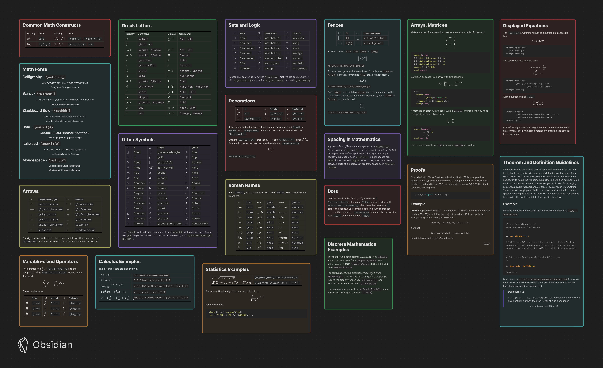

| Prefix | File Type                   |
| :----: | :-------------------------- |
|   @    | Folder Note                 |
|   %    | Template                    |
|   +    | Tag Note                    |
|   ,    | System                      |
|   \_   | Temporary                   |
|   }    | Misc/Combination/TBD        |
|   ~    | Notes                       |
|   -    | Topic                       |
|   $    | CheatSheet/Header           |
|   !    | Project/something I'm doing |
|   =    | Code                        |
|   '    | Article                     |
|   &    | Reference/Source            |

| Prefix Combination Examples | File Type                    |
| :-------------------------: | ---------------------------- |
|             ~!              | notes about possible project |
|             ~&              | Notes about reference        |
|             @!              | Project Folder               |
|             @-              | Folder for a topic           |
|             \_~             | temporary notes              |

