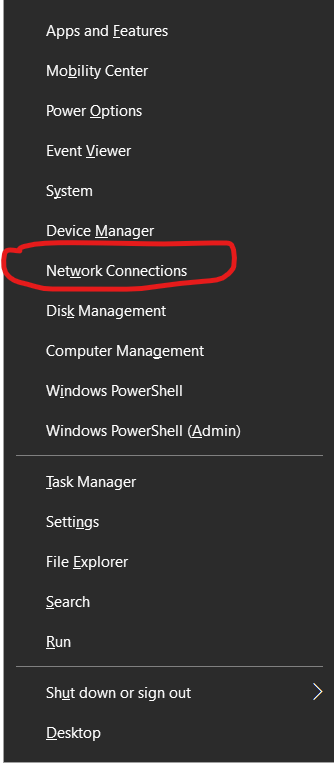
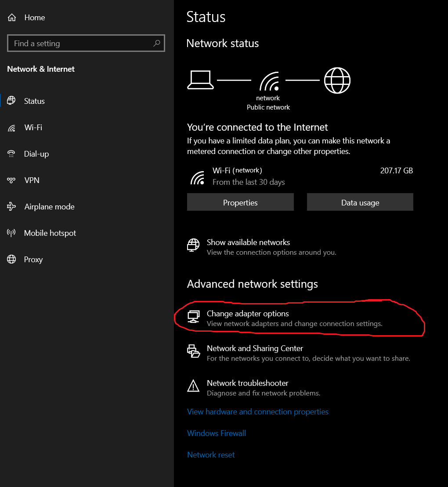
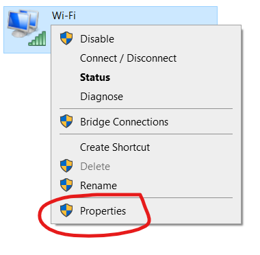
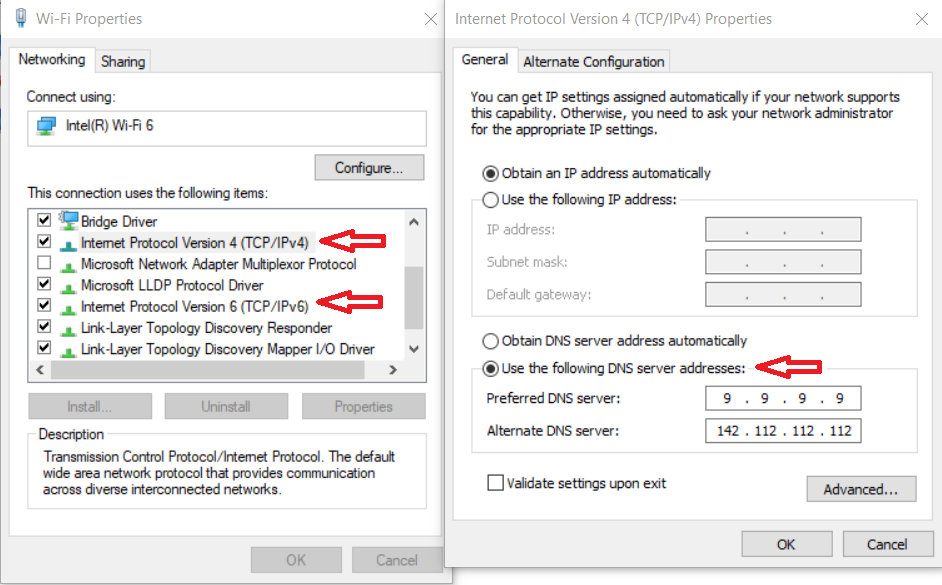
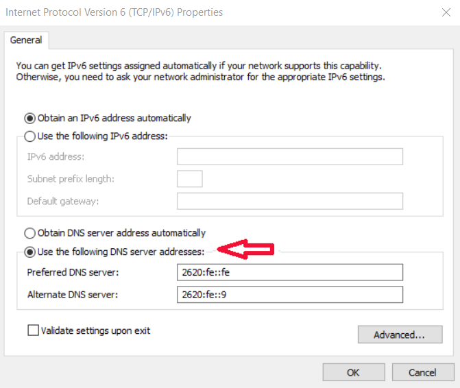
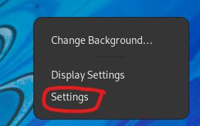
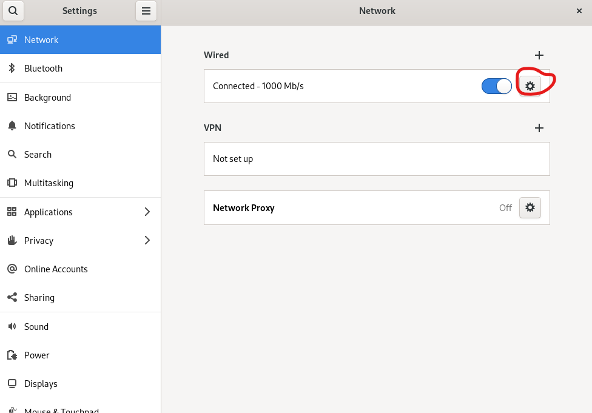
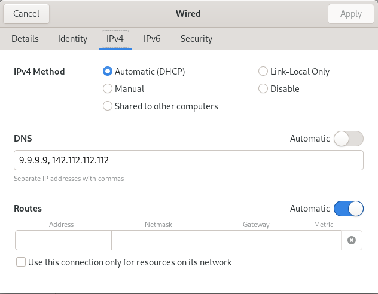
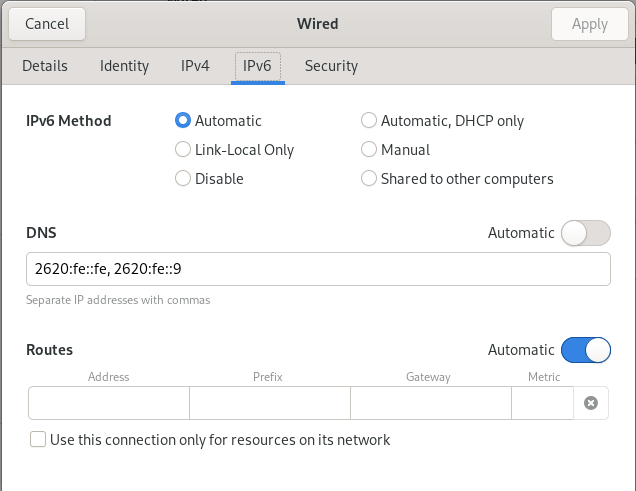

# What is DNS?

The Domain Name System ([DNS](https://en.wikipedia.org/wiki/Domain_Name_System)) is the phonebook of the Internet. Humans access websites through domains like google.com or youtube.com etc.<br>
Web browsers interact through [Internet Protocol (IP)](https://wikipedia.org/wiki/IP_address) addresses. DNS translates domain names to IP addresses so the browsers would "understand" what site you'r referring to.<br>

Each device connected to the Internet has a unique IP address which other machines (servers/computers) use to find the device.<br>
DNS servers eliminate the need for humans to memorize IP addresses such as `192.168.1.1` (in [IPv4](https://wikipedia.org/wiki/IPv4)), or more complex newer alphanumeric IP addresses such as `fe80::1ff:fe23:4567:890a` (in [IPv6](https://wikipedia.org/wiki/IPv6)).

## How does DNS work?

The process of DNS resolution involves converting a hostname (i.e www.example.com) into a computer-friendly IP address (i.e `192.168.1.1`).<br>
An IP address is given to each device on the Internet, and that address is necessary to find the appropriate Internet device - like a street address is used to find a particular home. When a user wants to load a webpage, a translation must occur between what a user types into their web browser (example.com) and the machine-friendly address necessary to locate the example.com webpage.<br>

In order to understand the process behind the DNS resolution, it’s important to learn about the different hardware components a DNS query must pass between. For the web browser, the DNS lookup occurs "behind the scenes" and requires no interaction from the user’s computer apart from the initial request.<br>

{data-gallery="dns"}

### Authoritative DNS server

Put simply, an authoritative DNS server is a server that actually holds, and is responsible for, DNS resource records. This is the server at the bottom of the DNS lookup chain that will respond with the queried resource record, ultimately allowing the web browser making the request to reach the IP address needed to access a website or other web resources. An authoritative nameserver can satisfy queries from its own data without needing to query another source, as it is the final source of truth for certain DNS records.

## What are the steps in a DNS lookup?

For most situations, DNS is concerned with a domain name being translated into the appropriate IP address. To learn how this process works, it helps to follow the path of a DNS lookup as it travels from a web browser, through the DNS lookup process, and back again. Let's take a look at the steps.

!!! info "DNS lookup"
    Often DNS lookup information will be cached either locally inside the querying computer or remotely in the DNS infrastructure. There are typically 8 steps in a DNS lookup. When DNS information is cached, steps are skipped from the DNS lookup process which makes it quicker.

### The 8 steps in a DNS lookup (assuming nothing is cached):

1. A user types ‘example.com’ into a web browser and the query travels into the Internet and is received by a DNS recursive resolver.
2. The resolver then queries a DNS root nameserver (.).
3. The root server then responds to the resolver with the address of a Top Level Domain (TLD) DNS server (such as .com or .net), which stores the information for its domains. When searching for example.com, our request is pointed toward the .com TLD.
4. The resolver then makes a request to the .com TLD.
5. The TLD server then responds with the IP address of the domain’s nameserver, example.com.
6. Lastly, the recursive resolver sends a query to the domain’s nameserver.
7. The IP address for example.com is then returned to the resolver from the nameserver.
8. The DNS resolver then responds to the web browser with the IP address of the domain requested initially.

Once the 8 steps of the DNS lookup have returned the IP address for example.com, the browser is able to make the request for the web page:

9. The browser makes a [HTTP](https://en.wikipedia.org/wiki/Hypertext_Transfer_Protocol) request to the IP address.
10. The server at that IP returns the webpage to be rendered in the browser (step 10).

{data-gallery="dns"}

## What is a DNS resolver?

The DNS resolver is the first stop in the DNS lookup, and it is responsible for dealing with the client that made the initial request. The resolver starts the sequence of queries that ultimately leads to a URL being translated into the necessary IP address.

Note: A typical uncached DNS lookup will involve both recursive and iterative queries.

It's important to differentiate between a [recursive DNS](/learning/dns/what-is-recursive-dns/) query and a recursive DNS resolver. The query refers to the request made to a DNS resolver requiring the resolution of the query. A DNS recursive resolver is the computer that accepts a recursive query and processes the response by making the necessary requests.<br>

{data-gallery="dns"}

## What are the types of DNS queries?

In a typical DNS lookup three types of queries occur. By using a combination of these queries, an optimized process for DNS resolution can result in a reduction of distance traveled. In an ideal situation cached record data will be available, allowing a DNS name server to return a non-recursive query.

### 3 types of DNS queries:

1. **Recursive query** \- In a recursive query, a DNS client requires that a DNS server (typically a DNS recursive resolver) will respond to the client with either the requested resource record or an error message if the resolver can't find the record.
2. **Iterative query** \- in this situation the DNS client will allow a DNS server to return the best answer it can. If the queried DNS server does not have a match for the query name, it will return a referral to a DNS server authoritative for a lower level of the domain namespace. The DNS client will then make a query to the referral address. This process continues with additional DNS servers down the query chain until either an error or timeout occurs.
3. **Non-recursive query** \- typically this will occur when a DNS resolver client queries a DNS server for a record that it has access to either because it's authoritative for the record or the record exists inside of its cache. Typically, a DNS server will cache DNS records to prevent additional bandwidth consumption and load on upstream servers.

## What is DNS caching? Where does DNS caching occur?

The purpose of caching is to temporarily stored data in a location that results in improvements in performance and reliability for data requests. DNS caching involves storing data closer to the requesting client so that the DNS query can be resolved earlier and additional queries further down the DNS lookup chain can be avoided, thereby improving load times and reducing bandwidth/CPU consumption. DNS data can be cached in a variety of locations, each of which will store DNS records for a set amount of time determined by a [time-to-live (TTL)](https://en.wikipedia.org/wiki/Time_to_live#DNS_records).

### Browser DNS caching

Modern web browsers are designed by default to cache DNS records for a set amount of time. The purpose here is obvious; the closer the DNS caching occurs to the web browser, the fewer processing steps must be taken in order to check the cache and make the correct requests to an IP address. When a request is made for a DNS record, the browser cache is the first location checked for the requested record.

!!! note "View your DNS"
    You can see the status of your DNS cache by typing in the address bar:
    ``` { .url .copy  title="Chrome"} 
        chrome://net-internals/#dns
    ```
    ``` { .url .copy  title="FireFox"} 
    about:networking#dns
    ```

### Operating system (OS) level DNS caching

The operating system level DNS resolver is the second and last local stop before a DNS query leaves your machine. The process inside your operating system that is designed to handle this query is commonly called a “stub resolver” or DNS client. When a stub resolver gets a request from an application, it first checks its own cache to see if it has the record.<br>If it does not, it then sends a DNS query (with a recursive flag set), outside the local network to a DNS recursive resolver inside the Internet service provider (ISP).

When the recursive resolver inside the ISP receives a DNS query, like all previous steps, it will also check to see if the requested host-to-IP-address translation is already stored inside its local persistence layer.

The recursive resolver also has additional functionality depending on the types of records it has in its cache:

1. If the resolver does not have the [A records](https://www.cloudflare.com/learning/dns/dns-records/dns-a-record/), but does have the [NS records](https://www.cloudflare.com/learning/dns/dns-records/dns-ns-record/) for the authoritative nameservers, it will query those name servers directly, bypassing several steps in the DNS query. This shortcut prevents lookups from the root and .com nameservers (in our search for example.com) and helps the resolution of the DNS query occur more quickly.
2. If the resolver does not have the NS records, it will send a query to the TLD servers (.com in our case), skipping the root server.
3. In the unlikely event that the resolver does not have records pointing to the TLD servers, it will then query the root servers. This event typically occurs after a DNS cache has been purged.

<br>

# How To Change DNS Settings in your system?

!!! info ""
    Exit everything that uses the network and then follow the steps below.

!!! example ""
    I am using Quad9 DNS, feel free to choose any other provider [some that I recommend](../Wiki/Links.md#dns).

## Windows PCs


**Steps:**

1. Click **Win Key + X**.
2. Click **Network Connections**.
3. Click **Change Adapter Options**.
4. Right-click the desired network adapter (Wired or Wi-Fi adapter).
5. Click on the **Properties** button.
6. Click on the **Internet Protocol Version 4 (TCP/IPv4)**.
7. Click on the **Properties** button.
8. Click on **Use the following DNS server addresses:**
9. Change the DNS servers to the ones you want.
10. Click on the **OK** button.
    \*Optional: Select IPv6 in Step 7 and continue to the next steps.

??? info "Click me to view screenshots for the steps above"
    <br>
    {data-gallery="windows"}
    <br>
    {data-gallery="windows"}
    <br>
    {data-gallery="windows"}
    <br>
    {data-gallery="windows"}
    <br>
    {data-gallery="windows"}
    <br>
    {data-gallery="windows"}
    <br>

**_Alternative Way:_**

1. Open the Windows Control Panel.
2. Click on the **Network and Internet** tab.
3. Click on the **Network** tab.
4. Click on the **Network And Sharing Settings** button.
5. Click on the connection name should be **Wired: (NETWORK NAME)** or **Wi-Fi: (NETWORK NAME)**.
6. Click **Properties**.
7. Continue from **step 6** above.

## Linux Machines

!!! note ""
    Im using Fedora 35, there might be slight differences in the settings for the other Distros though the general guidelines are the same.

**Steps:**

1. Right-click the desktop.
2. Click **Settings**.
3. Click **Network**.
4. Click **IPv4**.
5. Turn Off **Automatic DNS**.
6. Change the DNS servers to the ones you want.
7. Click on the **Apply** button.
   \*Optional: Select IPv6 in Step 4 and continue to the next steps.

**_Alternative Way:_**
Change DNS using the **terminal**, example [Here](https://www.linuxfordevices.com/tutorials/linux/change-dns-on-linux)

??? info "Click me to view Linux screenshots"
    <br>
    {data-gallery="linux"}
    <br>
    {data-gallery="linux"}
    <br>
    {data-gallery="linux"}
    <br>
    {data-gallery="linux"}
    <br>

[^1]: Thanks for CloudFlare for their post, for further information and more details check their blog: [What is DNS? | How DNS works](https://www.cloudflare.com/en-ca/learning/dns/what-is-dns/)
